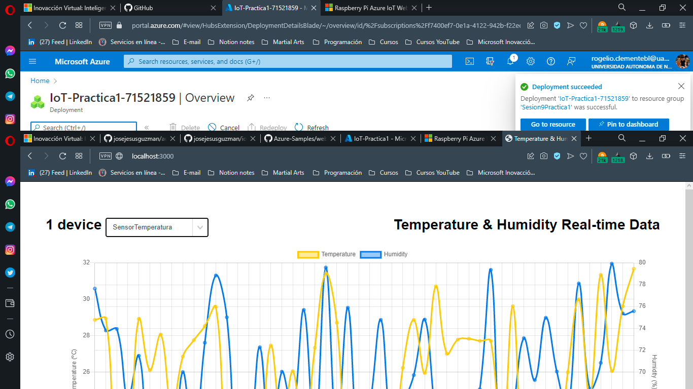

# Azure IoT

## Herramientas usadas
* Azure IoT Hub
* Azure App Service
* Simulated Temperature Sensor (Este lo buscas desde el Marketplace con este nombre en Inglés)
* Azure Cloud Shell con Bash
* [Repositorio web-apps-node-iot-hub-data-visualization](https://github.com/Azure-Samples/web-apps-node-iot-hub-data-visualization)
* [Git](https://git-scm.com/downloads)
* [Simulador Raspberry Pi](https://azure-samples.github.io/raspberry-pi-web-simulator/#getstarted)
* [Node.js](https://nodejs.org/en/download/)
* En Windows debes [poner la variable de entorno](https://bertofern.wordpress.com/2019/01/08/solucion-node-js-npm-no-reconocido-como-comando-interno-o-externo/)

## Creación de IoT Hub con Azure CLI

## Adjuntamos un sensor de temperatura simulado y agregamos la Raspberry Pi Simulada

## Visualización de los datos de RaspBerry Pi en web

#