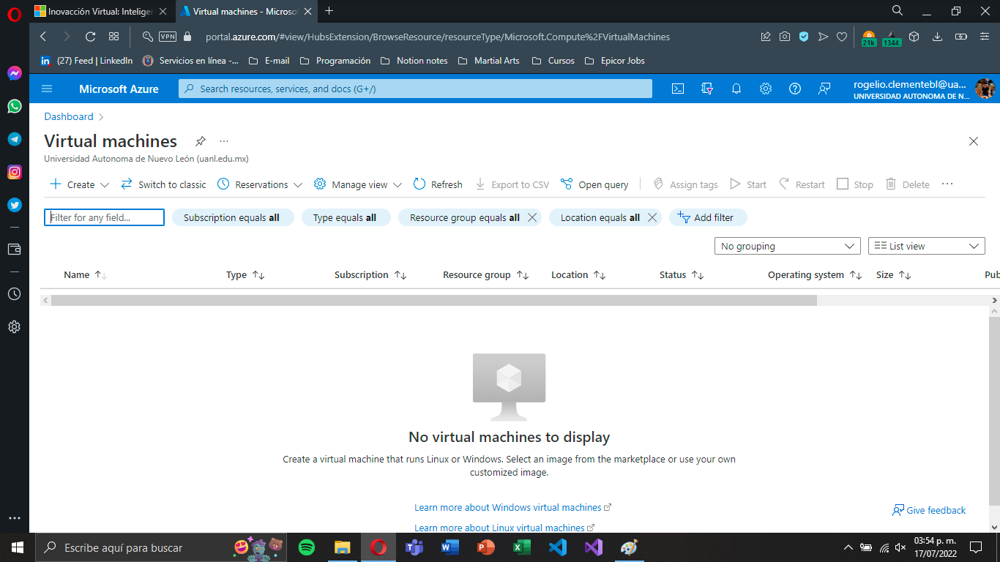
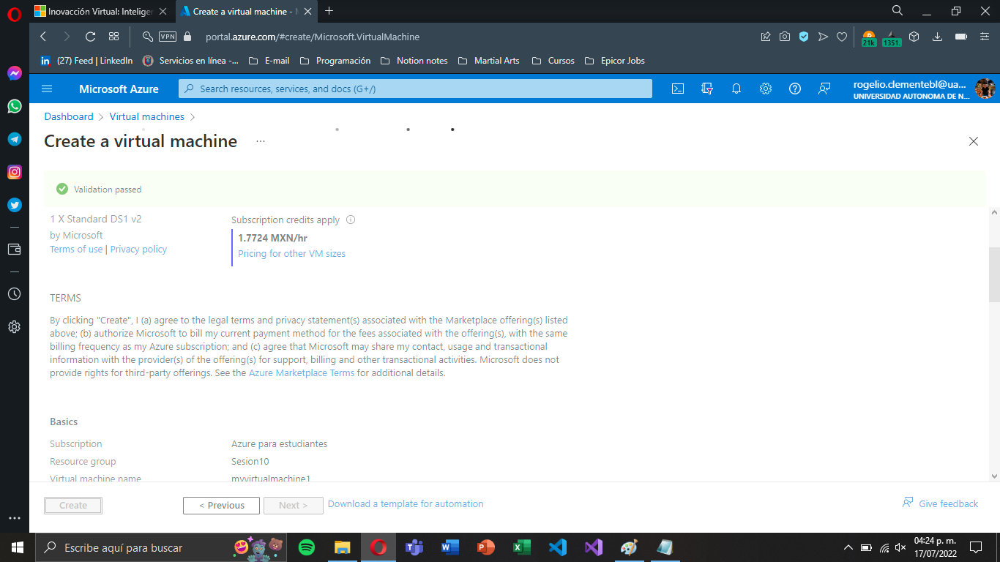
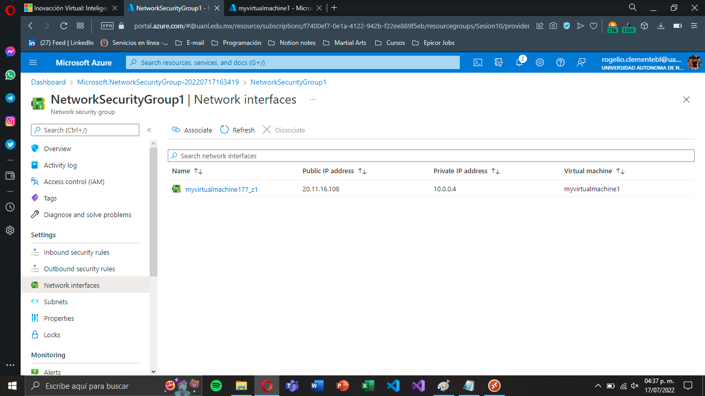
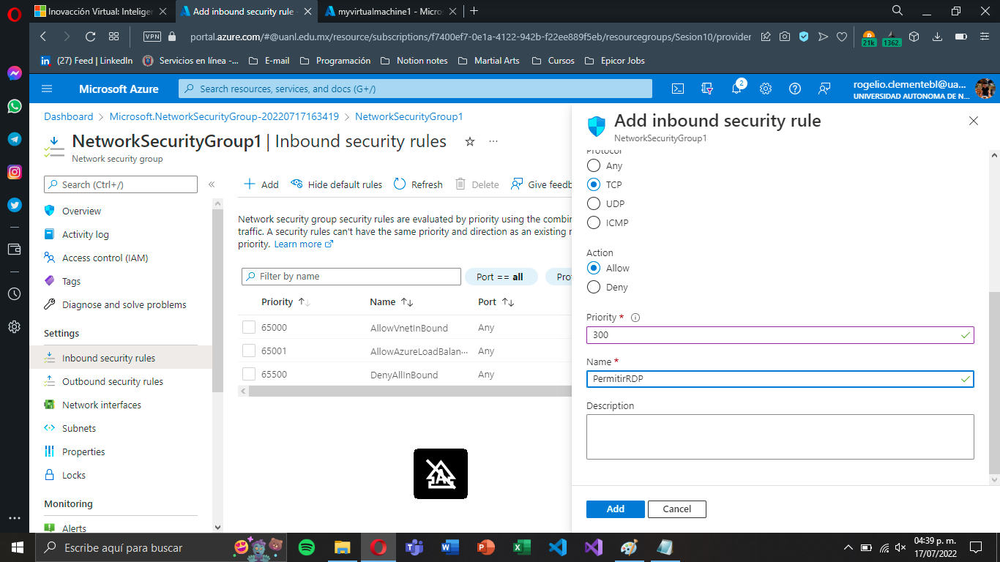
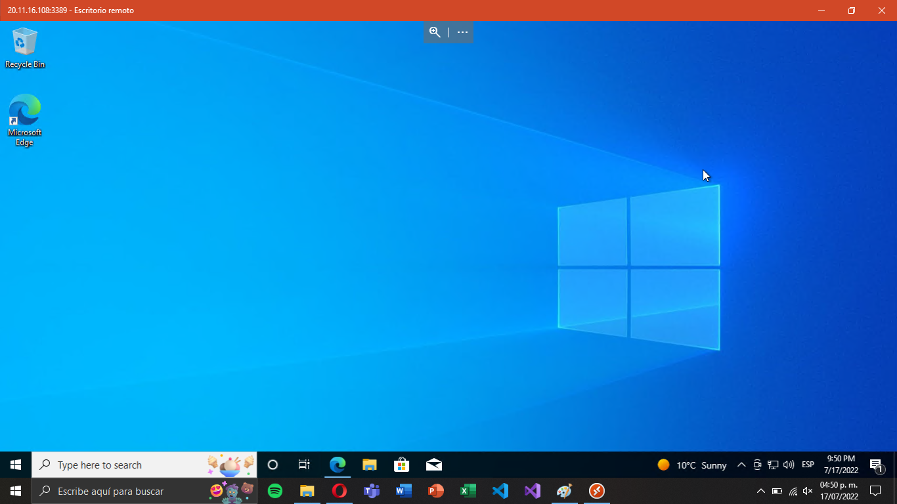
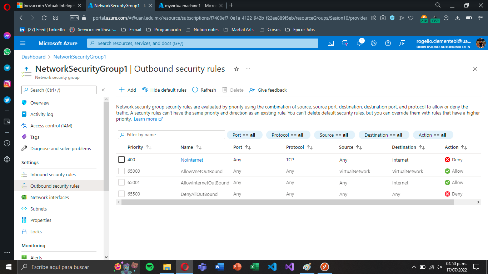
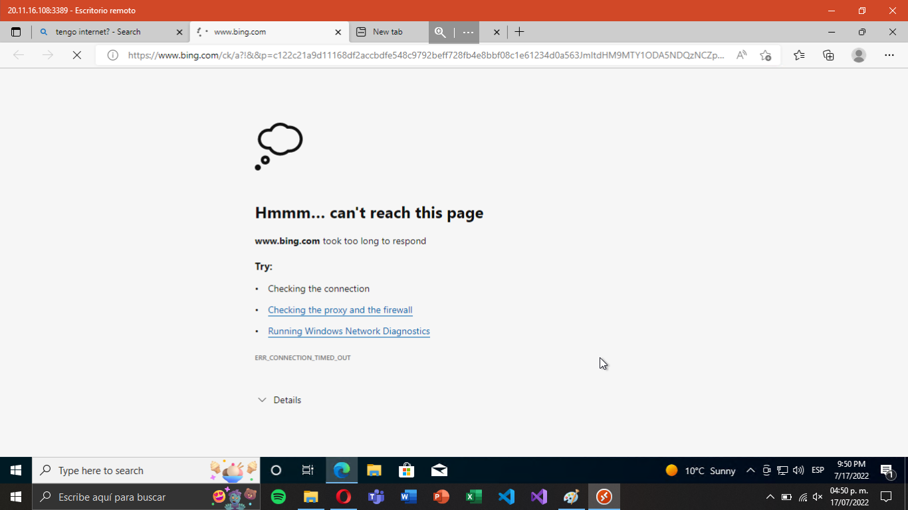

# Azure Network Security Group

Practica en la cual se llevo a cabo una prueba de recursos de un grupo de seguridad de red mediante una máquina virtual.

## Creamos una máquina virtual.

## Así mismo creamos un grupo de recursos para una grupo de seguridad de red.

## Establecemos parametros para hacer prueba del grupo de seguridad y comprobamos que los ejecuta de manera correcta.

---
### Recursos:
- Azure Virtual Machines
- Azure Network Security Group

#