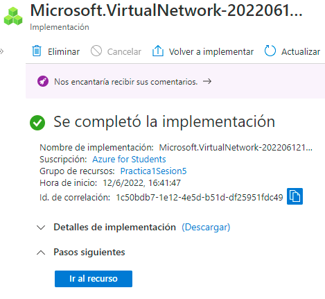

# Certificación Microsoft Azure AZ-900
Repositorio de prácticas llevadas a cabo durante el desarrollo de la certificación.


#
# Azure Blob Storage
Implementación de los servicios de Azure Blob Storage.

- El primer paso es crear un grupo de recursos dentro del servicio de cuentas de almacenamiento.

- Una vez validado y creado el grupo de recursos nos direccionaremos a la seccion de contenedores y procederemos a crear un contenedor.

- Dentro del contenedor podemos importar cualquier cantidad de archivos, en este caso implementamos un conjunto de archivos HTML y esto nos generara un URL mediante el cual podemos ver el archivo importado. En este caso si queremos implementar un sitio estático, buscamos dentro de los servicios de Azure Blob Storage la sección de sitios estáticos y seguimos los pasos para subir archivos y de igual manera nos generara un URL y podremos ver nuestro sitio web estático.


---
*Autor: Rogelio Clemente Balderas*

*Fecha: 10/07/202*

Requisitos:
    
- Azure Storage
- Azure Blob Storage  

#

# Azure Machine Learning

En esta práctica lo que harás será crear un modelo de predicción de diabetes de acuerdo con un dataset brindado. Todo lo harás con el portal de Azure y Machine Learning Studio. Además, aprenderás a usar un poco mejor la plataforma.


---
```python
endpoint = 'YOUR_ENDPOINT' #Replace with your endpoint
key = 'YOUR_KEY' #Replace with your key
import json
import requests
#An array of features based on five-day weather forecast
x = [[1,1,2022,1,0,6,0,2,0.344167,0.363625,0.805833,0.160446],
    [2,1,2022,1,0,0,0,2,0.363478,0.353739,0.696087,0.248539],
    [3,1,2022,1,0,1,1,1,0.196364,0.189405,0.437273,0.248309],
    [4,1,2022,1,0,2,1,1,0.2,0.212122,0.590435,0.160296],
    [5,1,2022,1,0,3,1,1,0.226957,0.22927,0.436957,0.1869]]
#Convert the array to JSON format
input_json = json.dumps({"data": x})
#Set the content type and authentication for the request
headers = {"Content-Type":"application/json",
        "Authorization":"Bearer " + key}
#Send the request
response = requests.post(endpoint, input_json, headers=headers)
#If we got a valid response, display the predictions
if response.status_code == 200:
    y = json.loads(response.json())
    print("Predictions:")
    for i in range(len(x)):
        print (" Day: {}. Predicted rentals: {}".format(i+1, max(0, round(y["result"][i]))))
else:
    print(response)
```
---
## Creación de un recurso de Aprendizaje automático


## Creación de un experimento


## Creación de un modelo con Machine Learning Designer


#

# Azure File Storage
Implementación de los servicios de Azure File Storage

- EL primer paso es ir a la sección de recursos compartidos de archivos y crear un recurso.

- Después importaremos un archivo cualquiera y daremos clic en conectar lo cual nos generara un grupo de comandos.

- Este grupo de comandos lo copiamos y pegamos en el Power Shell de Windows generandonos así el uso compartido de archivos con Azure.


---
Autor: Rogelio Clemente Balderas

Fecha: 10/07/2022

Requisitos:
- Azure Storage
- Azure File Storage

#

# Azure Functions

1. Crear un grupo de recursos para Azure Functions.

2. Al generar un recurso Functions hay que dirigirse a la ventana de funciones y crear una función para lo que se desea ejecutar.

3. En este caso se realizó una función para hacer una conección API mediante scripts en JSON y proceder a realizar las pruebas.


Resultado:
-


#
Autor: Rogelio Clemente Balderas
Programa Inovaccion Virtual 

Requisitos: 
-
- Cuenta y licencia Azure.
- Azure Functions Services.
#

# Azure IoT

## Herramientas usadas
* Azure IoT Hub
* Azure App Service
* Simulated Temperature Sensor (Este lo buscas desde el Marketplace con este nombre en Inglés)
* Azure Cloud Shell con Bash
* [Repositorio web-apps-node-iot-hub-data-visualization](https://github.com/Azure-Samples/web-apps-node-iot-hub-data-visualization)
* [Git](https://git-scm.com/downloads)
* [Simulador Raspberry Pi](https://azure-samples.github.io/raspberry-pi-web-simulator/#getstarted)
* [Node.js](https://nodejs.org/en/download/)
* En Windows debes [poner la variable de entorno](https://bertofern.wordpress.com/2019/01/08/solucion-node-js-npm-no-reconocido-como-comando-interno-o-externo/)

## Creación de IoT Hub con Azure CLI


## Adjuntamos un sensor de temperatura simulado y agregamos la Raspberry Pi Simulada


## Visualización de los datos de RaspBerry Pi en web


#

# Azure Key Vault

## Creación de recursos para guardar contrañes o claves privadas.


#

# Azure Logic App

1. Generar grupo de recursos para servicio Logic App Services.

2. Crear recurso de analizador de sentimientos en Cognitive Services.
3. Generar diagrama de procesos para la aplicación logica conectando una cuenta de twitter y teams.


4. Durante cada sección de la aplicación se le deben asignar parametros que se utilizaran para el proceso del API.
5. La aplicación en este caso detecta todos los tweets que inclutan el #IAWizards y se programa para que reciba los parametros del texto, usuario y fecha, datos que dee recibir un excel en Google Drive , mismo que se programa durante el diagrama de flujo y finalemente estos datos los enviara en forma de aviso al grupo de teams conectado.


#
Autor: Rogelio Clemente Balderas
-

Requisitos:
-
- Azure Logic Apps Services
- Recurso de Cognitive Services lenguaje analizador de sentimientos
- Cuenta de Twitter
- Cuenta Google Drive
#

# Azure Network
Implementación de los Azure Network Services al crear una conección entre 2 máquinas virtuale, cada una con su respectiva red enlazada entre sí.

#
Procedimiento:
-
1. Generar un grupo de recursos.
2. Crerar 2 redes virtuales (red1 y red2) en el apartado de Virtual Networks, cada una deberá tener una sub red (subred1 y subred 2) y ambas redes se deberán agregar al mismo grupo de recursos previamente creado.

3. Posterior a eso se deberán crear 2 Virtual Machines las cuáles se deben generar conn autenticación que requiera de un user y un password. Estas máquinas virtuales deberán tener la misma region que las redes antes generadas. Dentro del área de creación de Virtual Machines nos vamos al apartado de redes y asignamos una red a cada una, en este caso, VM1 a VN1 así como VM2 a VN2 y procederemos a verificar y crear.

4. Ya una vez creados estos recuros nos iremos a la primera máquina virtual y nos conectaremos mediante SSH, esto nos mostrara una página en la cual nos iremos a la zona que dice ssh -i <("ruta de acceso de clave privada")> y copiaremos el usuario generado que esta continuo a este script.
    * Nota: este username fue el cual creaste al hacer la máquina virtual así como el password.

5. Después abriremos la consola de comandos de Azure Cloud Shell y mediante el tipo de consola Bash comprobaremos las credenciales iniciando sesión como [ssh "usarname"]  y damos enter y nos pedirá el password.

6. Habiendo hecho esto, conectaremos las 2 redes virtuales previamente creads yendonos en este caso a cualquiera de las 2, en este caso lo hicimos en la segunda red virtual y nos iremos al apartado de emparejamientos y crearemos uno nuevo. Ahí mismo llenamos los datos que nos pidemos y crearmos el emparejamiento de amabas redes.

7. Finalemente comprobaremos el emparejamiento yendonos a cualquiera de las redes y en el área de dispositivos conectados del lado izquierdo, copiaremos la dirección IP mmostrada y nos iremos a cualquier máquina virtual. Dentro de esta abriremos la consola de comandos explicada anteriormente, iniciamos sesión y escribiremos el comando ping "Dirección IP copiada" y nos mostrara todo el historial de intercambio entre ambas redes comprobando así la comunicación entre las redes de ambas máquinas virtuales.


#
Autor: Rogelio Clemente Balderas
-

Requisitos:
-
- Cuenta y sucripción en Azure.
- Azure Virtual Network Services.
- Azure Virtual Machines Services.
#

# Azure Network Security Group

Practica en la cual se llevo a cabo una prueba de recursos de un grupo de seguridad de red mediante una máquina virtual.

## Creamos una máquina virtual.


## Así mismo creamos un grupo de recursos para una grupo de seguridad de red.

## Establecemos parametros para hacer prueba del grupo de seguridad y comprobamos que los ejecuta de manera correcta.


---
### Recursos:
- Azure Virtual Machines
- Azure Network Security Group

#

# Azure Queue Storage
Implementación del servicio de colas para Azure.

Este es un servicio muy simple para generar mensajes de manera automática por ejemplo. El primero paso es ir al apartado de colas y crear un recurso.

Finalmente colocamos el mensaje deseada entre otras especificaciones y ya tendríamos nuestro mensaje creado.


---
Autor: Rogelio Clemente Balderas

Fecha: 10/07/2022

Requisitos:
- Azure Storage
- Colas

#

# Azure Sentinel

## Se crea el grupo de recursos para generar un sentinela que ejerce laborales de análisis.


#

# Consultas de SQL para Azure SQL Database

Recursos que vas a necesitar:
- Azure SQL Database
- Repositorio DP-900 -> https://github.com/MicrosoftLearning/DP-900T00A-Azure-Data-Fundamentals
- Azure Cloud Shell activado

1. Ejecuta los siguientes comandos en el **Azure Cloud Shell"" en el orden en el que se encuentran:


```Bash
git clone https://github.com/MicrosoftLearning/DP-900T00A-Azure-Data-Fundamentals dp-900
```

```Bash
cd dp-900/sql
```

```Bash
bash setup.sh
```

**NOTA:** Debes esperar a que se termine de ejecutar el comando anterior para correr el siguiente.

2. Ve al recurso **SQL Database** y agrega tu IP en la sección "Set Server Firewall. Si no lo haces, no podrás seguir

3. Busca en las opciones del lado izquierdo "Editor de consultas SQL" o "Query Editor"

4. Los accesos para el Servidor de bases de datos son los siguientes:

```Bash
login="sampleLogin"
password="samplePassword123!
```

5. Si no tiene datos la Base de datos ejecuta el siguiente Query:

```sql

CREATE TABLE Inventory (
	Id int PRIMARY KEY, 
	Name VARCHAR(50), 
	Stock INTEGER
);

CREATE TABLE CustomerOrder (
	Id int PRIMARY KEY, 
	CustomerName VARCHAR(50),
    Quantity int,
    Created DATETIME,
    InventoryId int FOREIGN KEY REFERENCES Inventory(Id)
);

INSERT INTO Inventory (Id, Name, Stock) VALUES (1, 'banana', 150); 
INSERT INTO Inventory (Id, Name, Stock) VALUES (2, 'orange', 154);
INSERT INTO Inventory (Id, Name, Stock) VALUES (3, 'apple', 23); 
INSERT INTO Inventory (Id, Name, Stock) VALUES (4, 'lemon', 254);


INSERT INTO CustomerOrder(Id, CustomerName, InventoryId, Quantity, Created) VALUES (1, 'John Smith', 2, 5, getdate());
INSERT INTO CustomerOrder(Id, CustomerName, InventoryId, Quantity, Created) VALUES (2, 'Jane Brown', 2, 8, getdate());
INSERT INTO CustomerOrder(Id, CustomerName, InventoryId, Quantity, Created) VALUES (3, 'Stephen Stone', 3, 3, getdate());
INSERT INTO CustomerOrder(Id, CustomerName, InventoryId, Quantity, Created) VALUES (4, 'Claire Smith', 1, 1, getdate());
INSERT INTO CustomerOrder(Id, CustomerName, InventoryId, Quantity, Created) VALUES (5, 'Sarah Fedun', 4, 3, getdate());
INSERT INTO CustomerOrder(Id, CustomerName, InventoryId, Quantity, Created) VALUES (6, 'Graham Hinson', 3, 9, getdate());
```

6. El siguiente comando devuelve todos los valores de la tabla *Inventory*

```sql
SELECT * 
FROM Inventory
```

7. Para mostrar solo el número de plátanos que hay en las existencias:

```sql
SELECT * 
FROM Inventory 
WHERE Name = 'banana'
```

8. Para recuperar los artículos de inventario ordenados por la cantidad en las existencias:

```sql
SELECT * 
FROM Inventory 
ORDER BY Stock
```

9. Muestra los detalles de los pedidos realizados por los clientes junto con la información de inventario relativa a cada artículo solicitado:

```sql
SELECT * 
FROM Inventory 
JOIN CustomerOrder ON Inventory.Id = CustomerOrder.InventoryId
```

10. En la siguiente consulta se suman las cantidades para generar un total

```sql
SELECT SUM(CustomerOrder.Quantity) 
FROM CustomerOrder
```

#

# Azure Tables

- El primer paso es crear un recurso desde el aprtado de tablas.

- Posteriormente entraremos al apartado de agregar entidades.

- Dentro de este apartado podemos crear tablas con sus respectivas propiedades similares a tablas de bases de datos.


---
Autor: Rogelio Clemente Balderas

Fecha: 10/07/2022

Requisitos:
- Azure Storage
- Azure Tables

#

# Azure Virtual Machines

La práctica consiste en implementar una máquina virtual.

Instrucciones:
-
1. Ir a Virtual Machines Services y crear un grupo de recursos así como la respectiva máquina virtual.
2. Te debe generar una dirección IP.
3. Descargar la aplicación Remote Desktop en la tienda de Microsoft.

4. Iniciar y concectar la máquina virtual como RDP.
5. Descargar archivo RDP y abrirlo con la app de Remote Desktop.

6. Tendrá el acceso a su máquina virtual ingresando sus credenciales y veran la interfaz de en este caso Windows 10.


#
Autor: Rogelio Clemente Balderas
Programa Inovaccion Virtual 

Requisitos: 
-
- Cuenta y licencia Azure.
- Azure Virtual Machine Services.
- Microsoft Store Remote Desktop App.
#

# Azure Web App

Implementación de sitio web estatico mediante el uso del servicio Azure Web Apps así como una herramienta del Azure Marketplace, WordPress.

1. Primero que nada debemos implementar una Web App y seleccionar la opción de sitio web estatico y generar el grupo de recursos.
2. Posteriormente iremos al Azure Marketplace y buscar "WordPress" y damos clic en crear.

3. Ya una vez procesado el grupo de recursos entramos al enlace del sitio web generado y la configuramos.
4. En este caso el sitio se nombro como: "wordpressstaticwebsitetesting.azurewebsites.net"
5. Gneramos un usario y una contraseña y se procede a generar el sitio web.

De esta manera ya podemos crear un sitio web estatico hospedado en Azure.

#
Autor: Rogelio Clemente Balderas
Programa Inovaccion Virtual 

Requisitos: 
- Cuenta y suscripción Azure.
- Azure Web App Services.
#

# Practica 1 Sesion 3

*Parte 1*
-
Instrucciones: 
-
1. Vas a entrar en el siguiente link -> https://colab.research.google.com/drive/1go6YwMFe5MX6XM9tv-cnQiSTU50N9EeT#scrollTo=CppIQlPhhwhs <-
	
2. Haz que la inteligencia artificial genere un video de lo que tu quieras

3. Recuerda poner lo que quieras en inglés
	
4. Espera hasta que se genere (Puede tardar hasta una hora dependiendo de las iteraciones que usaste)
	
5. Publica el video que se descargó en cualquier red social y en el formato que más prefieras
	
6. En tu publicación menciona que palabras usaste para que la IA genere eso
	
7. Etiquetar al sherpa como @brujeriatech o @josejesusguzman (Instagram) @josejesus8 (twitter) y usa los hashtags #IAWizards e #InnovaccionVirtual

Resultado:
-
Palabra para la IA: "Bitcoin"


*Parte 2*
-
Instrucciones: 
-

Ve a esta página -> https://www.artbreeder.com <-
	
1. Elige a la Waifu, Husbando o al personaje 2D de tu preferencia
	
2. Usa las imagenes dentro de la plataforma para generar tu personaje en 3D
	
3. Publica el resultado en cualquier red social y en el formato que más prefieras
	
4. Menciona que personaje es en tu post
	
5. Etiqueta al sherpa como @brujeriatech o @josejesusguzman (Instagram) @josejesus8 (twitter) y usa los hashtags #IAWizards e #InnovaccionVirtual


Resultado:
-
Personaje: "Hatsune Miku"


#
Autor: Rogelio Clemente Balderas
Programa Inovaccion Virtual 

Requisitos: 

- Sitios proporcionados.
- Poco conocimiento de Python.

#

