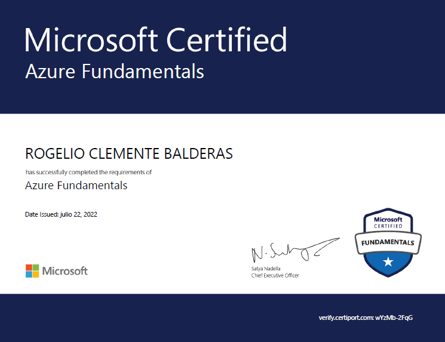

# Certificación Microsoft Azure AZ-900
### Repositorio de prácticas llevadas a cabo durante el desarrollo de la certificación.

*Rogelio Clemente Balderas* *Fullstack Software Developer*

---
## Listado de prácticas.

### [Inteligencia Artificial](IA.md) 
### [Azure Blob Storage](AzureBlobStorage.md) 
### [Azure Virtual Machines](AzureVirtualMachine.md)
### [Azure IoT](AzureIoT.md)
### [Azure Logic App](AzureLogicApp.md)
### [Azure Network Security Group](AzureNSG.md)
### [Azure Functions](AzureFunctions.md)
### [Azure File Storage](AzureFileStorage.md)
### [Azure Cognitive Services](AzureCognitiveServices.md)
### [Azure Sentinel](AzureSentinel.md)
### [Azure SQL Database](AzureSQLDatabase.md)
### [Azure Tables](AzureTables.md)
### [Azure WebApp](AzureWebApp.md)
### [Azure Key Vault](AzureKeyVault.md)
### [Azure Azure Queue Storage](AzureQueueStorage.md)
### [Azure Azure Network](AzureNetwork.md)